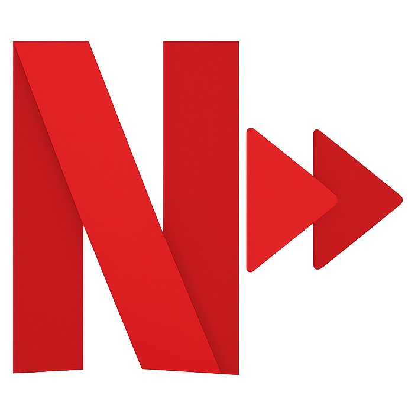

*This project was developed using Cursor and represents a first trial of using an all-AI coding environment for complete software development.*

---
# Netflix Speed Boost  

  

Skip the boring slow parts! 🚀 A Chrome extension that lets you temporarily speed up Netflix videos with a simple hold gesture.

## ✨ Why You'll Love This

- **🎬 Skip the Boring Parts**: Hold and speed through slow scenes, intros, or recaps
- **⚡ Super Easy**: Just hold anywhere on the screen or press your custom key
- **🎯 Smart & Safe**: Won't mess with Netflix's controls - works perfectly alongside them
- **🎨 Looks Great**: Beautiful wave animations show when you're speeding up
- **⚙️ Your Way**: Pick any speed from 1.25× to 5× and any key you want
- **🔒 Private**: No tracking, no data collection - everything stays on your device
- **☁️ Syncs Everywhere**: Your settings follow you across all your Chrome browsers

## 📦 Installation

### From Chrome Web Store (Recommended)
*[Coming soon - link will be added after publication]*

### Manual Installation (Development)
1. Clone or download this repository
2. Open Chrome and navigate to `chrome://extensions/`
3. Enable "Developer mode" in the top right corner
4. Click "Load unpacked"
5. Select this repository folder (contains manifest.json)
6. The extension is now loaded and ready to use!

## 🎬 How to Use

1. **Go to Netflix**: Open any show or movie
2. **Set Your Speed** (optional): Click the extension icon to pick your favorite speed and key
3. **Speed It Up**: When you hit a boring part:
   - Hold **anywhere on the screen**, OR
   - Hold your custom key (default: 'L')
4. **Let Go**: Release to instantly return to normal speed

**💡 Pro Tip**: It works anywhere on the screen except Netflix's controls, so you won't accidentally mess up Netflix's interface!

## ⚙️ Customize Your Experience

Click the extension icon to make it yours:

### 🚀 Speed Settings
- **How Fast**: Choose from 1.25× to 5× (1.5× is perfect for most people)
- **Easy Picker**: Just drag the slider to your favorite speed

### ⌨️ Your Speed Key
- **Pick Any Key**: Set any key as your speed trigger (we suggest 'L')
- **Smart Setup**: Click "Set Key" and press whatever you want
- **No Conflicts**: We'll warn you if you pick a key Netflix already uses

### 🎨 Visual Effects
- **Wave Animation**: Pretty waves show when you're speeding up (looks cool!)
- **Speed Display**: Optional text showing your current speed

### 🔄 Reset
- **Start Over**: One click resets everything to defaults

## 🔒 Your Privacy Matters

**We respect your privacy - no funny business here!**

- ❌ **No tracking** - we don't watch what you watch
- ❌ **No data collection** - your viewing habits stay private
- ❌ **No servers** - everything happens on your device
- ✅ **Your settings** - stored locally and synced across your browsers
- ✅ **Open source** - you can see exactly what it does
- ✅ **Minimal permissions** - only what it needs to work

See [docs/PRIVACY_POLICY.md](docs/PRIVACY_POLICY.md) for the full details.

## 🚀 Get Started in 3 Steps

1. **Install**: Follow the installation steps above
2. **Customize**: Click the extension icon to set your speed and key
3. **Enjoy**: Start watching and speed through the boring parts!

## 📚 Documentation

- **[AI Context](docs/AI_CONTEXT.md)** - Development context for AI tools
- **[Privacy Policy](docs/PRIVACY_POLICY.md)** - Privacy and data handling
- **[Changelog](docs/CHANGELOG.md)** - Version history

## 🛠️ Development

### Prerequisites
- Chrome browser
- macOS/Linux (for icon generation script)
- `sips` command-line tool (included on macOS)

### Key Binding Development
- **Key Capture Logic**: `popup.js` - Interactive key binding system
- **Key Handling**: `content.js` - Custom key event handlers
- **Settings Management**: Chrome sync storage for key preferences

## 📋 Browser Compatibility

- ✅ Google Chrome (Manifest V3)
- ✅ Microsoft Edge (Chromium-based)
- ✅ Brave Browser
- ✅ Any Chromium-based browser with Manifest V3 support

## 🛠️ Having Issues?

### Not working at all?
1. **Refresh Netflix**: Press F5 or Cmd/Ctrl+R
2. **Make sure video is playing**: It only works on active videos
3. **Try both ways**: Hold the right side OR your custom key
4. **Check your key**: Make sure it's set right in settings
5. **Check console**: Press F12 to see any error messages

### Speed won't go back to normal?
This shouldn't happen, but if it does:
1. Refresh the page
2. If that doesn't work, reinstall the extension

### Netflix controls not working?
Make sure you're not holding over Netflix's control bar. The extension is smart and won't interfere with Netflix's buttons.

## 📝 Changelog

### Version 1.1.4 (Latest)
- **NEW**: Full screen clickable area - works anywhere on screen, not just right third
- **NEW**: Enhanced control detection - better protection of Netflix's interface
- **NEW**: Unicode speed indicator with ▶▶ symbol for better visual feedback
- **IMPROVED**: Speed indicator positioned in center-right for better visibility
- **CHANGED**: Default settings - speed indicator enabled, wave animation disabled
- **FIXED**: Passive event listener errors - no more console errors
- **FIXED**: Control bar interaction - more reliable clicking on Netflix controls

### Version 1.1.3
- **FIXED**: SPA navigation - extension now works seamlessly with Netflix's single-page navigation
- **FIXED**: Browse to watch navigation - extension activates automatically without refresh
- **FIXED**: Watch to browse navigation - extension deactivates automatically
- **IMPROVED**: Event-driven navigation detection (no more polling or loops)
- **IMPROVED**: Better performance with multiple detection methods
- **IMPROVED**: Cleaner console logging

### Version 1.1.2
- **FIXED**: Extension now only works on Netflix watch pages, not browse pages
- **FIXED**: No more interference with video previews/trailers on browse pages
- **IMPROVED**: Better scope control and performance

### Version 1.1.1
- **NEW**: Automatic settings initialization - works immediately after installation
- **NEW**: Playback state validation - prevents speed boost on paused videos
- **IMPROVED**: Better first-time user experience
- **FIXED**: Extension now works without opening popup on first install
- **FIXED**: No more accidental speed boost on paused videos

### Version 1.1.0
- **NEW**: Customizable key binding system (default: 'L' key)
- **NEW**: Interactive key capture interface in settings
- **NEW**: Smart key validation to prevent conflicts
- **IMPROVED**: Dual activation methods (click + key hold)
- **IMPROVED**: Better user experience with flexible key options
- **FIXED**: Resolved conflict with Netflix's spacebar play/pause functionality

### Version 1.0.0 (2025-10-04)
- Initial release
- Customizable speed boost (1.25× to 5×)
- Wave animation visual feedback
- Optional text speed indicator
- Fullscreen support
- Settings sync across devices
- Smart control detection
- Production-ready code with proper error handling

## 🤝 Contributing

Contributions are welcome! Please feel free to submit issues and pull requests.

### Development Guidelines
- Maintain Manifest V3 compliance
- Keep privacy-first approach (no tracking/analytics)
- Test on actual Netflix content
- Follow existing code style
- Update documentation for new features

## 📄 License

MIT License - feel free to use and modify as needed.

## ⚠️ Disclaimer

This extension is not affiliated with, endorsed by, or sponsored by Netflix, Inc. Netflix is a trademark of Netflix, Inc.

The extension only modifies local playback speed in your browser and does not circumvent any DRM, download content, or violate Netflix's Terms of Service.

## 🌟 Love It? Help Us Out!

If this extension makes your Netflix experience better:
- ⭐ **Star the repo** - it really helps!
- 📝 **Leave a review** on the Chrome Web Store
- 🐛 **Report bugs** or suggest cool new features
- 📢 **Tell your friends** - share the Netflix love!

---

**Made with ❤️ for better Netflix viewing**

